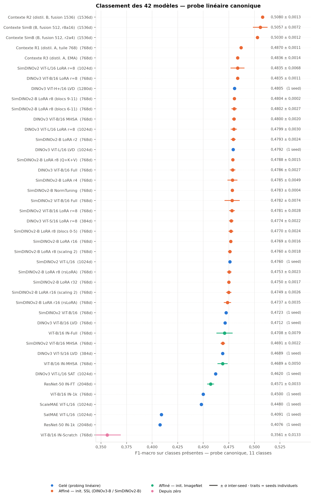
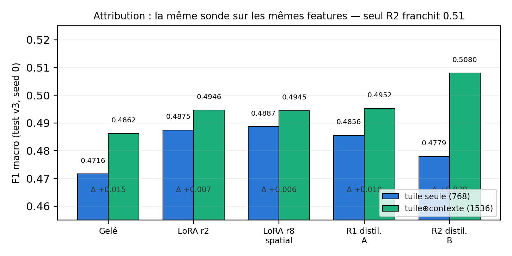
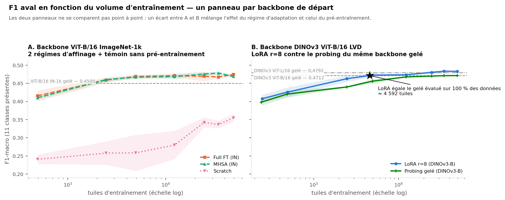
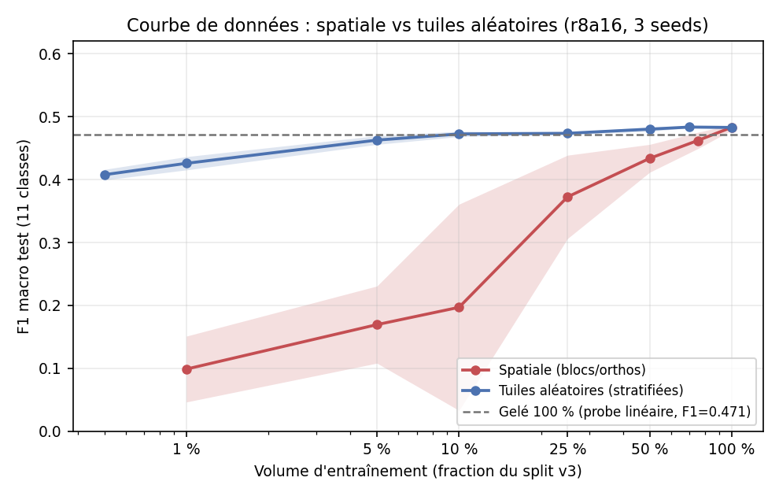
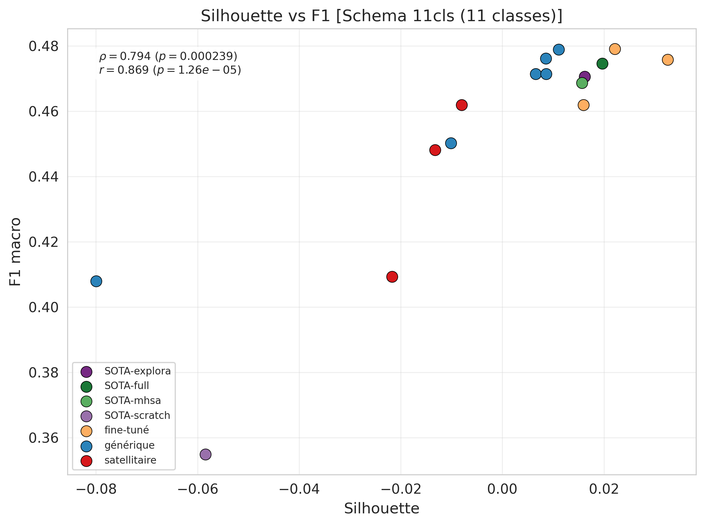
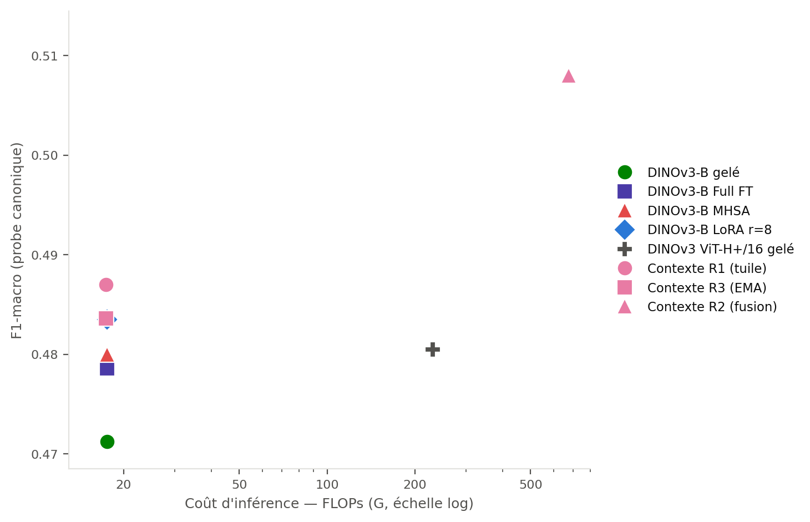

# Frozen vs. fine-tuned vision models for Arctic tundra vegetation mapping

This repository holds the code and results of my Master's project at UQAM. The
question I set out to answer was a practical one: if you want to map Arctic
tundra vegetation from drone imagery, do you need to fine-tune a vision model
on your own data, or is a frozen pretrained backbone good enough?

The short answer is that fine-tuning helps, but only up to a point. On this task
it lets a small model catch up to a much larger frozen one. It never overtakes
it. What does move the ceiling is giving the model information it does not
already have, mainly spatial context.

Everything is evaluated on Arctic-TVC, a dataset of very-high-resolution drone
imagery (about 2.2 mm per pixel) collected at Trail Valley Creek, Northwest
Territories. The task is 12-class vegetation classification from image tiles.

## What I compared

42 model configurations, all evaluated with the same linear probe on the same
train/validation/test split:

- **11 frozen backbones**: ResNet-50 and ViT-B/16 (ImageNet), DINOv3 at four
  scales (LVD-142M), three satellite-pretrained geospatial models (SatMAE,
  Scale-MAE, DINOv3-SAT), and two botanically pretrained models (SimDINOv2).
- **31 fine-tuned configurations**, three seeds each, covering full fine-tuning,
  attention-only, LoRA at rank 8, training from scratch, and a 13-arm LoRA/PEFT
  ablation on SimDINOv2-B.

Fine-tuned models are re-probed after training: the classification head used
during training is thrown away, embeddings are extracted, and a fresh linear
probe is fitted with exactly the same procedure as for frozen models. The
number I report is therefore a property of the representation, not of the head
that happened to be attached to it.

## The ranking



The top of the tier, macro-F1 over the 11 classes present in the test split:

| Model | Regime | F1 |
|---|---|---:|
| Context fusion, learned head (DINOv3-B) | fused bound | 0.5080 |
| SimDINOv2-B, frozen, fused readout | fused bound | 0.5059 |
| DINOv3-B, LoRA r=8 | LoRA | 0.4835 |
| DINOv3-H+/16 | frozen | 0.4805 |
| DINOv3-L/16 (LVD) | frozen | 0.4792 |
| SimDINOv2-B, norms + head only | 47k params | 0.4783 |
| SimDINOv2-B | frozen | 0.4723 |
| DINOv3-B | frozen | 0.4712 |
| SatMAE ViT-L/16 | frozen | 0.4091 |

## Four results worth flagging

### Adaptation catches up, it does not overtake

At matched architecture, LoRA r=8 beats its own frozen DINOv3-B by +0.0114
(paired bootstrap, p = 0.0012). But no deployable configuration beats the best
frozen model: the gap is +0.0038 at p = 0.39. The best frozen models are simply
larger, and size buys more than fine-tuning does here.

### The PEFT landscape is flat

Thirteen LoRA variants, spanning rank 2 to 32, different scalings, different
block placements, and Q+V versus Q+K+V, all land within 0.0067 of each other.
The most striking result is that updating only the normalization layers plus the
head, 47k parameters and no adapters at all, matches LoRA rank 8 to within a
thousandth (p = 0.94).


### Spatial context is the only thing that moves the ceiling

Fusing each tile with its 512-pixel neighbourhood adds +0.025 to +0.034, and a
frozen model with a fused readout reaches 0.5059 without a single gradient step.
The controls matter: context alone is no better than the tile alone, and a
*permuted* context does worse than the tile alone, so it is the aligned
neighbourhood information that helps and not just the extra pixels.



### Satellite-pretrained models transfer poorly to drone imagery

SatMAE (0.4091) and Scale-MAE (0.4480) sit at the bottom of the ranking, and
DINOv3-L pretrained on satellite data (0.4620) is clearly behind the same
architecture pretrained on natural images (0.4792). A geospatial training corpus
is not a good guide to performance when the target resolution is three orders of
magnitude finer.

## Learning curves



Fine-tuning on a strong pretrained backbone costs a lot of data and returns
little: LoRA needs roughly 4,600 tiles just to match its own frozen backbone,
and ends only +0.012 above it. On a weaker backbone the same regimes overtake
their frozen baseline after about 2,000 tiles and gain +0.025. The random tile
draw also flatters results. Under a spatially blocked draw, performance at 1% of
the data drops from 0.426 to 0.099, and the two curves only converge at 100%.



## Can geometry predict which model will win?

Partly. Class separability measured on frozen embeddings (Fisher ratio,
Davies-Bouldin, Calinski-Harabasz, silhouette) ranks the 35 models of the
competitive tier significantly better than chance, and keeps doing so under
leave-one-model-out validation. The spectral family does the opposite: effective
rank and participation ratio order the tier *inverted*, and are only usable with
their sign learned from the data, which defeats the purpose.



The separability metrics rank models but do not predict their F1 precisely. At
best they beat the mean of the other 34 by 0.0004 of MAE, on a tier whose whole
F1 range is about 0.04. They are a shortlisting tool, not an estimator.



## Layout

```
src/                Python package (models, probe, metrics, geometry)
scripts/            extraction, probing, analysis, figure generation
configs/            YAML configs for every model and regime
splits/             train/val/test assignment (spatial, by whole orthomosaic)
results/            canonical result files
figures/            figures used in this README
probe.py            CLI: linear probe and k-NN
extract.py          CLI: feature extraction
analyze.py          CLI: latent space analysis
train.py            CLI: fine-tuning
make_figures.py     CLI: figure generation
```

## Running it

```bash
pip install -r requirements.txt

# extract features for a frozen model
python extract.py --config configs/frozen_dinov3_lvd.yaml

# linear probe + k-NN
python probe.py --config configs/frozen_eval.yaml

# latent space analysis
python analyze.py --config configs/frozen_eval.yaml
```

Two practical notes, both of which cost me time to learn. The probe forces
single-threaded BLAS before importing NumPy. The number of threads changes the
order of floating-point reductions, and `lbfgs` converges to a slightly
different solution as a result: about 0.0015 of F1, which is 19% of the
between-seed standard deviation. And results are only comparable across models
if the same regularization grid is used everywhere, which is not the case in
older parts of this repository. The canonical grid has six points,
C ∈ {1e-4, …, 10}.

## Data

Arctic-TVC is publicly available on FRDR:
[doi:10.20383/103.01418](https://doi.org/10.20383/103.01418).

The dataset covers 38 drone orthomosaics, 35 of them annotated along vegetation
transects as 12 classes. The train/validation/test split assigns each whole
orthomosaic to a single split, so no tile from a test orthomosaic can appear in
training.

## License

Code under MIT. Figures and results under CC-BY-4.0. See `LICENSE`.
